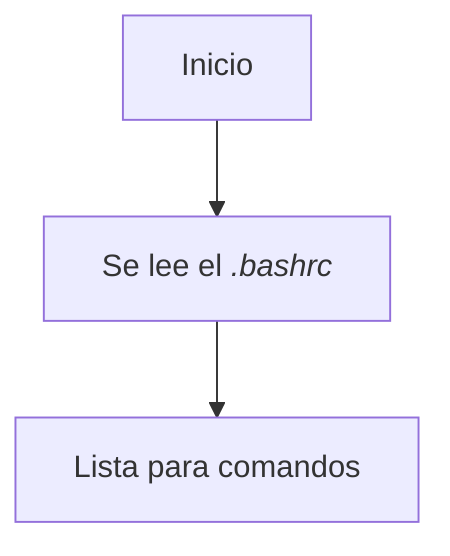
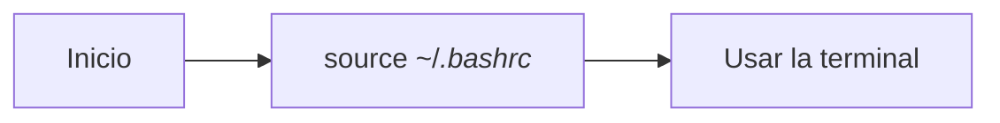
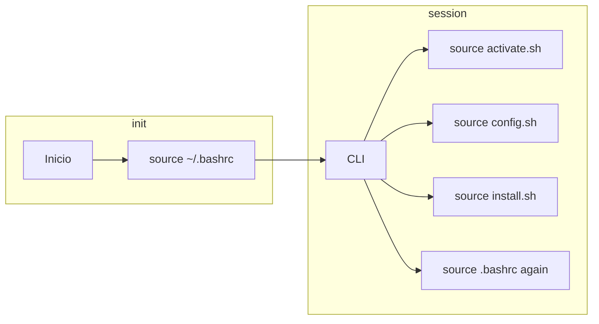

# TLDR

Este es un minicurso de los commandos más básicos que necesitas para moverte en la terminal, el curso se basa en [en este blog](https://openwebinars.net/blog/La-guia-definitiva-para-aprender-a-usar-la-terminal-de-Linux/)

# Introducción

A diferencia de [[Windows]], en linux se acostumbra a usar la **terminal** o **linea de comandos** para configurar el sistema.

> [!definition] Linea de comandos
> La **interfaz de línea de comandos** o **interfaz de línea de órdenes** (en [inglés](https://es.wikipedia.org/wiki/Idioma_ingl%C3%A9s "Idioma inglés"): _command-line interface_, **CLI**) es un tipo de [interfaz de usuario de computadora](https://es.wikipedia.org/wiki/Interfaz_de_usuario "Interfaz de usuario") que permite a los usuarios dar instrucciones a algún [programa informático](https://es.wikipedia.org/wiki/Software "Software") o al [sistema operativo](https://es.wikipedia.org/wiki/Sistema_operativo "Sistema operativo") por medio de una línea de texto simple.
   -- <cite>[Wikipedia](https://es.wikipedia.org/wiki/Interfaz_de_l%C3%ADnea_de_comandos)</cite>

En otras palabras, es una **interfaz de usuario** en la que puedes escribir commandos para la computadora

# Abrir la Terminal

```sh
edy@laptop:/home/edy: 
```

Aquí es donde puedes escribir los commandos de la terminal

Por ejemplo el comando **whoami**:

```sh
$ whoami
edy
```

Este te dice que usuario eres. A continuación se verán los comandos más básicos para moverte en la terminal en la sección [Moverte En El File System](documentation/Introduccion%20a%20Linux.md#Moverte%20En%20El%20File%20System)

# Estructura de un Comando

Para todos los comandos de linux tenemos lo siguiente:

```sh
<comando> -<flag> --<flag> <arg1> <arg2>
```

- `<comando>`: Nombre del comando que quieres ejecutar
- `-<flag> --<flag> ...`: Bandera (usualmente son opciones para cambiar la ejecucion del comando).
- ` <arg1>, <arg2>, ...`: Argumentos que le pasas al comando

Por ejemplo:

```sh
ls -a homework/
```

El comando es `ls`, con la bandera de `-a`, y el argumento de `homework/`

# Navegación Por El FileSystem

Estos comandos sirven para navegar por el FileSystem (FS):

- `pwd`: *Print working directory* Te dice en que ubicación estás
- `ls`: *list* Te puestra los archivos y los directorios
	- `ls -l`: Te muestra más información
	- `ls -a`: Te muestra todos los archivos, incluyendo los ocultos
- `cd <directory>`: *Change directory* te mueve al directorio que le pongas
	- `cd ..`: Te mueve un directorio atras
	- `cd <directory>`: Te mueve al directorio que le pones
	- `cd`: Te mueve a home
	- `cd ~`: Te mueve a home
- `mkdir <directory>`: Crea un directorio en el `pwd`
- `rmdir <directory>`: Elimina un directorio vacío
- `touch <filename>`: Crea un archivo en el `pwd`
- `rm <filename>`: Elimina un archivo
	- `rm -r <folder>`: Elimina un folder y sus contenido
	- `rm -rf <anything>`: **Cuidado**, este elimina cualquier cosa sin restricciones

# Activar Configuración (.bashrc)

Las terminales se pueden configurar de muchas maneras (e.g):

- Agregar aliases
- Configuraciones generales
- Configurar ambientes virtuales
- Auto completado de commandos
- Funciones propias
- Entre otros...

Sin embargo, la manera de que esos cambios sean permanentes, lo puedes poner en el archivo `.bashrc`.

La terminal se inicia de la siguiente manera:



^98a36b

Para *leer* la configuración, se usa el comando `source ~/.bashrc` que sirve para poder activar las configuraciones:



Entonces si quieres agregar más configuraciones mientras tengas las terminal abierta, puedes hacer *source* otros archivos:



^2d5420

Con esto se puede habilitar configuraciones en la session de terminal

# Using Python

[Python](documentation/Python.md) es accesible desde la terminal como:

```sh
$ python3 # en algunas puede ser `python` 
```

^a117d1

Y puedes correr archivos de la siguiente manera:

```sh
$ python3 main.py  
```

^dd2dba

Si quieres usar **ambientes virtuales** en [Python](documentation/Python.md), puedes ver la sección de [Ambientes virtuales](documentation/Python.md#Ambientes%20virtuales).

# Using Git

[[Git]] se accede desde la terminal así:

```sh
$ git --version
```

[Taller de Git y Github MOC](Taller%20de%20Git%20y%20Github%20MOC)

# Comandos

## Chmod

`chmod` (Change mode) es un comando que puede cambiar el modo de un archivo. Los 3 modos que existen son: Read (r), Write (w) y Execute (x)

Para agregar o quitar un modo a un archivo, puedes usar el comando y agregar (+) o quitar (-) el modo

```bash
chmod +x main.py
```
