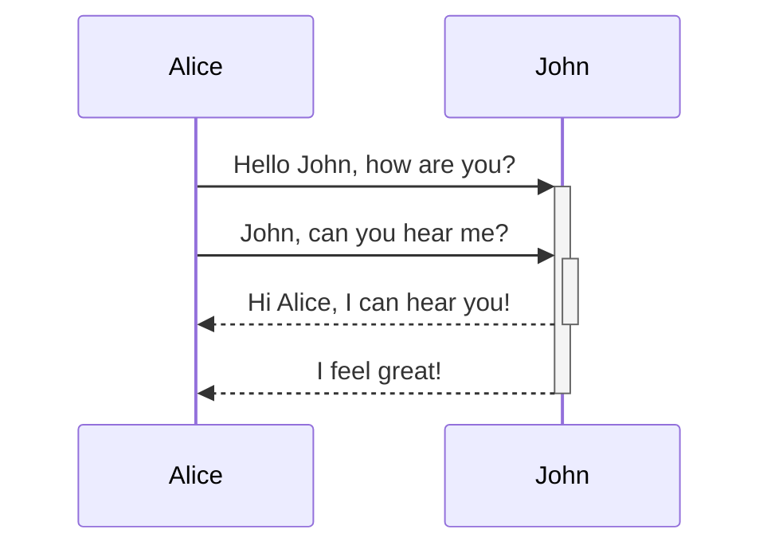

# Ejemplo de Presentacion

Para verla, corre el comando "Show Slide Preview" de [Advanced Slides](documentation/Advanced%20Slides.md)

---

Esto es una presentación hecha con **Advanced Slides**


[Puedes checar la documentación aqui](https://mszturc.github.io/obsidian-advanced-slides/)

---

Estas son las ventajas de hacerlo con texto

- Es más rápido escribir
- Tenemos más control sobre el contenido
- Podemos importar texto de otros archivos
- Podemos subirlo a github

note: 

Puedes tener notas de orador!! Puedes acceder a ellas si entras en la presentación en el browsers y luego oprimes `S` 

---

<split even gap="1">

Se puede manejar el layout de la presentación, usando elementos de `grid` y de `split`, pero la mayoría de los casos no es necesario


</split>

---

Se pueden poner expresiones matemáticas con *Latex*

$$
x = {-b \pm \sqrt{b^2 - 4ac} \over 2a}
$$

---

Puedes poner código también: 

```python

def say_name(name : str) -> None: 
	print(name)

if __name__ == "__main__":
	name = "Eduardo"
	say_name(name) # Outputs name

```


---

<!-- slide bg="https://picsum.photos/seed/picsum/800/600" data-background-opacity="0.5" -->
## Siempre puedes cambiar los backgrounds

---

### Puedes poner soporte a Excalibur

![[Excalidraw/Dibujo Tutorial.excalidraw.png]]

note: 

Solamente que los dibujos tienen que ser con **Wiki links**

---

### Tambien puedes poner tablas

First Header | Second Header
------------ | ------------
Content from cell 1 | Content from cell 2
Content in the first column | Content in the second column

---

## Gráficas, of course




---

## Puedes hacer slides que vayan hacia abajo

Por ejemplo los tipos de exports que hay: 

--

### PDF

--

### HTML

---

Puedes hacer mucho!! Desde agregar más contenido, cambiar estilos, cambiar colores y posiciones, etc

Para más información, visita [la documentación](https://mszturc.github.io/obsidian-advanced-slides/)


