---
course:
  - "[[school/Courses/Club de Robotica]]"
description: Presentación del taller de Git y Github
dueDate: 2023-09-01
enableChalkboard: true
isDone: true
relatedProject: "[[Taller de Git y Github MOC]]"
slideNumber: true
startedDate: 2023-08-23
enableTimeBar : false
tags:
  - school/task
  - presentation
taskStatus: doing
highlightTheme: css/vs2015.css
taskType: task
theme: beige
mermaid:
  themeVariables:
    fontSize: 16px
---

# 🐙Taller de Git y Github

::: block

**By:** Eduardo Gómez

**For:** Club de robótica

**Date:** 2023-09-20

:::

---

🐙

# Bienvenidxs al taller de Git y Github !!

🐙

note: Preguntar por: 

- Experiencia usando Git y Github
- Experiencia programación
- Que conocen de Git y Github

---

## Agenda del taller

1. Requerimientos para el curso
1. ¿Quien es su instructor ?
1. La vida sin Git
1. Introducción a Git y Github (Caso práctico)
1. Tips and Tricks

---

## Lista de requerimientos 

+ 💻Una computadora
+ 🌐Tener una cuenta de **Github**
+ 🚀Descargar **Github Desktop** 

---

## ¿Quien es su instructor?

- **Nombre:** Eduardo Gómez (Edy)
- **Carrera:** ITR 9no semestre
- **Grupo:** Club de Robótica
%% - **Gustos:** Programación, Robótica, Videojuegos, Box, Comida Extravagante, etc %%
- **Experiencia con Git y Github**: Desde pandemia 🦠


---

# Sección 1: Vida antes de Git 💀💀

---

## :pencil:Caso de la vida real

Tu profesor de la clase de programación encarga una tarea _en equipo_:


+ Implementar _BubbleSort_ en python
+ Implementar la solución de _FizzBuzz_
+ Hacer una _investigación_ de algoritmos de sorteo

note: Preguntarles como se organizarían

---

### Workflow ideal

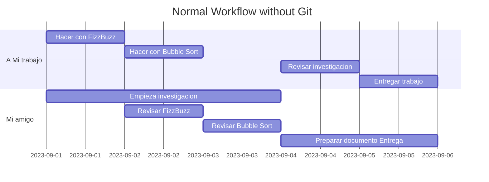

---

## Sección 1: Vida sin Git 😔

--

Primero haces tu implentación de **FizzBuzz**:

```python
for fizzbuzz in range(50):
    if fizzbuzz % 3 == 0 and fizzbuzz % 5 == 0:
        print("fizzbuzz")
        continue
    elif fizzbuzz % 3 == 0:
        print("fizz")
        continue
    elif fizzbuzz % 5 == 0:
        print("buzz")
        continue
    print(fizzbuzz)
```

--

Luego te haces tu implenetación de **Bubble sort**

```python
def bubbleSort(arr):
    n = len(arr)
    for i in range(n-1):
        for j in range(0, n-i-1):
            if arr[j] > arr[j + 1]:
                arr[j], arr[j + 1] = arr[j + 1], arr[j]
```

--

Luego necesites que tu compañero revise tu código...

¿Cómo le compartes código?

note: preparar para el uso de wha

--

<grid drag="50 50" drop="topleft" >
![[C6076B05-520B-433B-91F4-842B5F46B900.jpeg]]
</grid>

<grid drop="right" >
![[FBB16AAF-05C3-4563-8798-179007E93543.jpeg]]
</grid>

<grid drag="50 50" drop="bottomleft"  >
![[2C8A8D21-8A1B-44CC-90DF-AF2A0C848471.jpeg]]
</grid>

note: Explicar como esto se vuelve un circulo visicoso

--

🤮

--

### Inicio del proyecto

![[talleres/Taller Github/attachments/fizzbuzz-correciones.jpeg|250]]

--

También necesitas revisar la investigación

![[talleres/Taller Github/attachments/investigacion-ignorada.jpeg|350]]

--

## Sorpresa!!

Cambio de requerimientos:

![[talleres/Taller Github/attachments/cambio en el trabajo.jpeg]]

Implementar _Quicksort_ en python en vez de _Bubble sort_

--

Implentación de **Quicksort**:

```python
def partition(array, low, high):
    pivot = array[high]
    i = low - 1
    for j in range(low, high):
        if array[j] <= pivot:
            i = i + 1
            (array[i], array[j]) = (array[j], array[i])
    (array[i + 1], array[high]) = (array[high], array[i + 1])
    return i + 1

def quickSort(array, low, high):
    if low < high:
        pi = partition(array, low, high)
        quickSort(array, low, pi - 1)
        quickSort(array, pi + 1, high)
```

--

### A empezar de nuevo

![[talleres/Taller Github/attachments/nuevo quicksort.jpeg|350]]

--

## Sorpresa parte 2

![[talleres/Taller Github/attachments/cambio en el trabajo.jpeg]]

Ahora necesita que entregues las **2** codigos

--

![[talleres/Taller Github/attachments/cambio de entrega.jpeg]]

--

Llego momento de hacer la entrega final:

![[talleres/Taller Github/attachments/resultado-sin-git.png]]

😳😳😳

---

### 🤔Reflexión

1. ¿Cuál fue el problema de este workflow?
2. ¿Cómo podría mejorarse?
3. ¿Les ha pasado?

note: 

Preguntarles que identifiquen cosas como en la siguiente slide les pones lo que tu piensas

- Problema para manejar las versiones
- Muchas correciones
- Cambios de repente
- Regreso en el tiempo

---

## Principales problemas

1. Manejar diferentes versiones de un mismo archivo
1. Regresar a versiones antiguas del proyecto
1. Compartir archivos entre los integrantes es difícil
1. Trabajar simultáneamente requiere coordinación

---

# Solución: Git & Github


note: No son lo mismo

---

## ¿Qué es Git?

**Git** es un sistema open source de control de versión, creado por Linux Torvalds (creador de Linux) en 2005.


Permite crear repositorios y mantener un _historial de versiones_. Adicionalmente, como es un sistema distribuido, cada desarrollador tiene su propia copia del proyecto.

note: Referencia https://www.atlassian.com/git

- Es el sistema de control más moderno
- Está diseñado para ser rápido, seguro y flexible

---

## ¿Qué es Github?

Es una _página web_ donde puedes subir tus repositorios de _git_ y compartirlos con el mundo.


Permite que los desarrollador puedan trabajar juntos y tener su repositorio en la nube.

note: Referencia [Pagina de github](https://docs.github.com/en/get-started/quickstart/hello-world)

Analogía: pueden verlo como un **Google Drive** pero en vez de subir documentos, subes repositorios que usan _git_

---

$$
\text{Git} \ne \text{Github}
$$

---

# Sección 2: Introducción a Git

note: Introducir que te da super poderes

---

## 🎮Git te da super poderes

--

### 🚩Crear Checkpoints


--

### 🌿Crear universos alternos


--

### 👥Colaborar con otras personas


--

### ⏳🔙Regresar en el tiempo


---

## :gear: Configuración inicial

1. Debes tener una cuenta de **Github**
1. Debes tener instalado **Github Desktop**
1. Puedes tener instalado **Git** y usarlo en la terminal (opcional)

note:

Lo puedes usar en la terminal, pero esta nos centraremos con la app

---

## :pencil:Empecemos con la tarea

Ahora haremos la misma tarea, pero usando **Git** y **Github**

---

### Crear un repositorio

![[talleres/Taller Github/attachments/Repositorio Inicial.png|400]]

Un repositorio es un folder que tiene **Git** activado

note: Hacer el tuyo con el nombre \<tu-nombre\>-taller-git

---


### Tu turno


**Crea un repositorio con el nombre taller-git**


---

<!-- .slide: data-auto-animate -->

### Veamos que hay en la carpeta

---

<!-- .slide: data-auto-animate -->

### Veamos que hay en la carpeta

![[talleres/Taller Github/attachments/folder-empty.png|300]]

+ Hay que activar carpetas ocultas

---

<!-- .slide: data-auto-animate -->

### Veamos que hay en la carpeta

![[talleres/Taller Github/attachments/git folders.png|300]]

La carpeta `.git` tiene los datos del repositorio. El file `.gitattributes` contiene información del proyecto

note:

Explicar que la carpeta de git se encarga de mantener la versión de tu proyecto

---

<!-- .slide: data-auto-animate -->

## FizzBuzz

![[talleres/Taller Github/attachments/fizzbuzz file.png|300]]

```python
for fizzbuzz in range(50):
    if fizzbuzz % 3 == 0 and fizzbuzz % 5 == 0:
        print("fizzbuzz")
        continue
    elif fizzbuzz % 3 == 0:
        print("fizz")
        continue
    elif fizzbuzz % 5 == 0:
        print("buzz")
        continue
    print(fizzbuzz)
```

---

<!-- .slide: data-auto-animate -->

## FizzBuzz

![[talleres/Taller Github/attachments/fizzbuzz-github-desktop.png]]

**Git** registra los cambios que haces en tus archivos

note:

Explicar que **git** obtiene los cambios de lo que escribiste. Setup para los **checkpoints**

---

<!-- .slide: data-auto-animate -->

### 🚩Crear Checkpoints

En **Git** la manera de trabajar es crear _checkpoints_ cuando hagas cambios importantes en tu proyecto. Estos _checkpoints_ se llaman **commits**

---

<!-- .slide: data-auto-animate -->

### 🚩Crear Checkpoints

![[talleres/Taller Github/attachments/primer-commit.png]]

note:
Decir que donde pueden estar, y enseñar los logs

---

### History \& Logs

![[talleres/Taller Github/attachments/logs-git.png]]

note: Se accede con History

---

### Tu turno


**Crea el archivo de bubble.py y haz un commit**

---

<!-- .slide: data-auto-animate -->

### Bubble Sort

```python
def bubbleSort(arr):
    n = len(arr)
    for i in range(n-1):
        for j in range(0, n-i-1):
            if arr[j] > arr[j + 1]:
                arr[j], arr[j + 1] = arr[j + 1], arr[j]
```

note: Enseñar el proceso

---

<!-- .slide: data-auto-animate -->

### Bubble Sort

![[talleres/Taller Github/attachments/history after bubble sort.png]]

Ya tenemos un historial de nuestro trabajo🥳

---

### 🤔Reflexión

¿ Qué ventajas tiene tener **checkpoints** en tu trabajo ?

---

Siguiente super poder...

---

<!-- .slide: data-auto-animate -->

## 🌿Crear universos alternos

---

<!-- .slide: data-auto-animate -->

## 🌿Crear universos alternos

Puedes crear **versiones alternas** de tu proyecto. Esto sirve para:

+ Manejar varias **versiones diferentes** de tu proyecto en un mismo repositorio
+ Trabajar de manera **simultanea** con otras personas

note: Setup para hablar de las ramas en relacion a la colaboracion

---

<!-- .slide: data-auto-animate -->

### Estado actual de tu repositorio

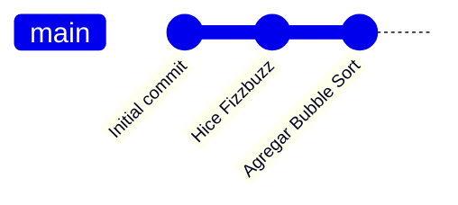

A esto se le llama **Rama** o **Branch**.

note:
Decir que esto es un universo alterno

---

<!-- .slide: data-auto-animate -->

### Estado actual de tu repositorio

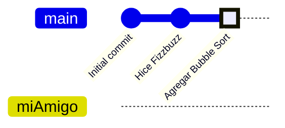

---

### 🌿Trabajo en universos alternos

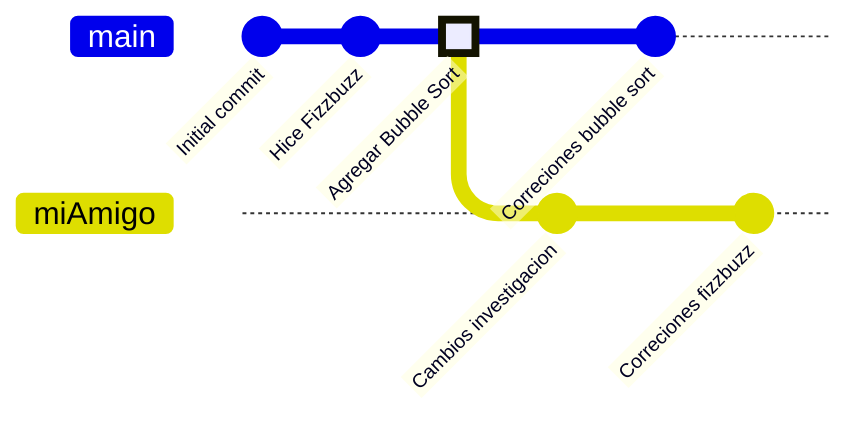

Cada **rama** es independiente de la otra!

note: Di también que no solamente es con otras personas, sino contigo mismo también

---

<!-- .slide: data-auto-animate -->

### Caso de uso para las ramas

Supongamos que necesitas hacer **optimizaciones a tu BubbleSort** sin perder tu versión actual


---

<!-- .slide: data-auto-animate -->

### Caso de uso para las ramas

Supongamos que necesitas hacer **optimizaciones a tu BubbleSort** sin perder tu versión actual

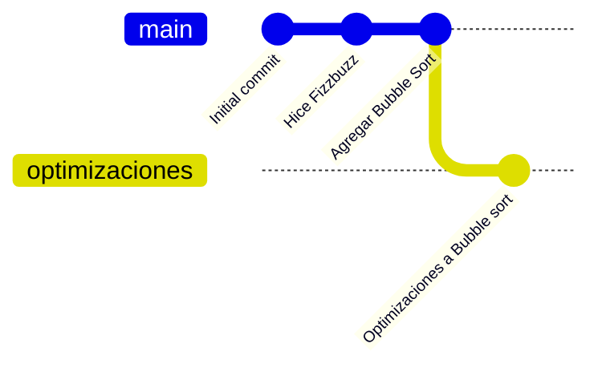

note:

Para esto, puedes picarle click derecho al commit, y hacer branch from this commit mostrar el ejemplo

La optimización es agregar el return del swapped

```python
def bubbleSort(arr):
    n = len(arr)
    swapped = False
    for i in range(n-1):
        for j in range(0, n-i-1):
            if arr[j] > arr[j + 1]:
                swapped = True
                arr[j], arr[j + 1] = arr[j + 1], arr[j]

        if not swapped:
            return
```

---

### Crear una rama en GithubDesktop

![[talleres/Taller Github/attachments/new-branch-for-optimization.png]]
![[talleres/Taller Github/attachments/new-branch-optimizaciones-show.png]]

---

### Tu turno


**Crea una rama y haz cambios en un archivo**

---

<!-- .slide: data-auto-animate -->

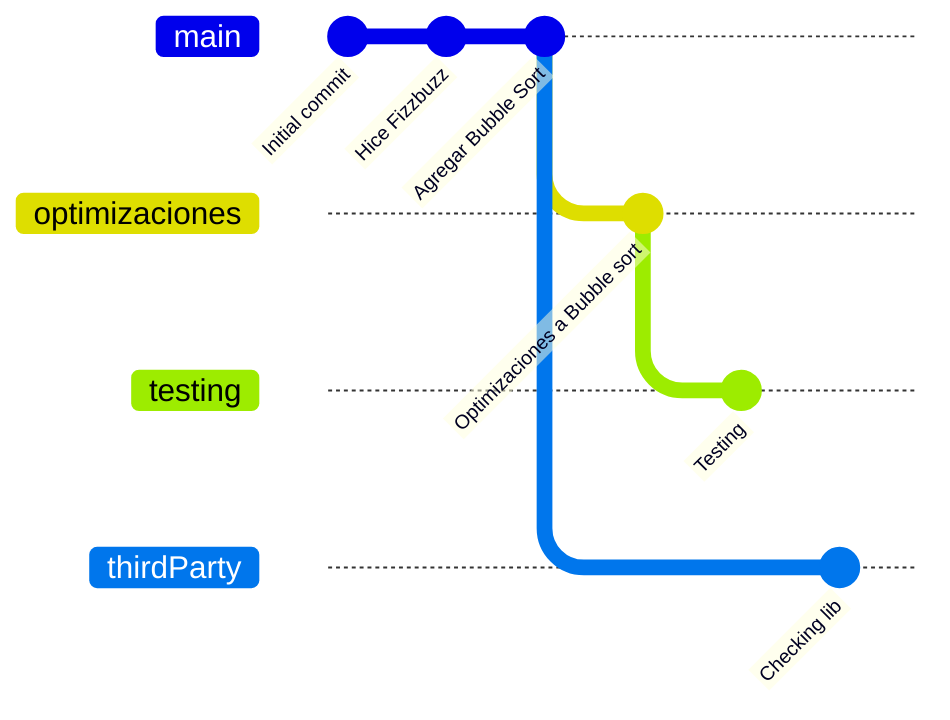

+ ¿Que hacemos con esto?

note:

Haz un setup para que digan "y luego que hacemos con esto?"

---

## Merging

Cuando quieres traer los cambios de una rama a otra puedes hacer un **merge**

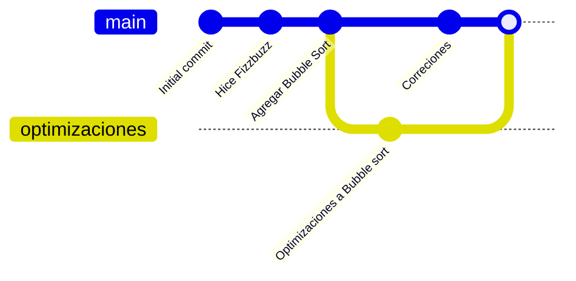

---

### Pasos para hacer Merge

1. Ponerte en la **rama base**
2. Elegir que **rama** quieres poner arriba de la **base**
3. Hacer el **merge**


En este caso _main_ es la **base** y _optimizaciones_ es la rama de **arriba**

note: Mostrar ejemplo primero

---

### Github Desktop

![[talleres/Taller Github/attachments/menu-merge.png]]

---

### Tu turno


**Haz un merge del main y la rama que creaste!!**

---

### 🤔Reflexión

¿ Qué ventajas tiene tener **universos alternos** en tu trabajo ?

---

Ahora, pasemos a **Github**

---

### 🌿Trabajo en universos alternos

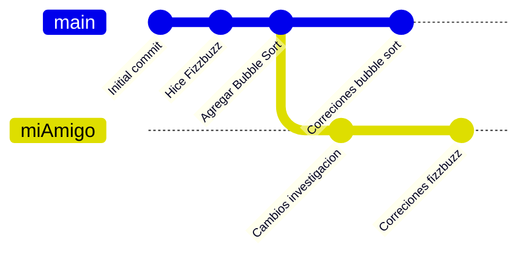

La idea es la **misma**. Cada quien trabaja en una rama separada, y luego hacen **merge**

note: Decir que la cosa, es que tienen que tener el mismo repositorio en cada computadora

---

¿Cómo compartimos el repositorio?🤔

---

## 👥Colaborar con otras personas

Ahora que tienes avances es momento de compartirlo. Para eso lo subiremos a **Github** y compartiremos el proyecto con nuestro compañero


---

## Como funciona Github

.png?width=1575&name=Frame%201%20(1).png)


Github $\rightarrow$ Sincronizas en Local $\rightarrow$ Actualizas a Github

note:

Para las flechas:

1. Subes tu repositorio a Github
2. Clonas tu repositorio en local y sincronizas los cambios
3. Actualizas los cambios en Github

---

<!-- .slide: data-auto-animate -->

### Pasos parar trabajar con Github


%% ---

<!-- .slide: data-auto-animate -->

### Pasos parar trabajar con Github

1. Subes tu repositorio a Github (**push**)
2. Lxs colaboradores hacen un **fork** del proyecto
3. Clonan el repositorio en su computadora local
4. Todxs hacen cambios en local (**push**)
5. Para integrar los cambios a otro repositorio, hacen un **pull request**
6. El dueño o el que tenga permisos, hace un **merge**
7. Sincronizas los cambios en tu repositorio local (**pull**) %%


---

### Subir tu repositorio a Github

![[talleres/Taller Github/attachments/Boton para subir cambios.png]]

Cuando subes una rama a **Github** se le llama **push**

note:

Ahi literalmente enseñas el paso a paso de como se sube

---

Subir una rama a Github sirve para tener un "backup" de tus ramas y para que esté accesible para todos los demás

---

#### Así se ve el repositorio en Github

![[talleres/Taller Github/attachments/Github Repo.png]]

---

¿Cómo puedo compartir el repositorio?

---

<!-- .slide: data-auto-animate -->

### 🍴Lxs colaboradores hacen un Fork del proyecto

Un **fork** es copiar el repositorio de alguien en tu cuenta.

---

<!-- .slide: data-auto-animate -->

### 🍴Lxs colaboradores hacen un Fork del proyecto

En este caso, mi compañero puede abrir el repositorio desde su cuenta de **Github**

![[talleres/Taller Github/attachments/github-merge-02.png|600]]

![[talleres/Taller Github/attachments/github-merge-03.png]]

note: Pasar el url a todos los del taller

---

<!-- .slide: data-auto-animate -->

### 🍴Lxs colaboradores hacen un Fork del proyecto

![[talleres/Taller Github/attachments/github-merge-04.png|750]]

note: Diles que "fork es como copiar el proyecto en su cuenta"

---

<!-- .slide: data-auto-animate -->

### 🍴Lxs colaboradores hacen un Fork del proyecto

![[talleres/Taller Github/attachments/github-merge-05.png|700]]

Este repositorio está ahora en tú cuenta!

---

<!-- .slide: data-auto-animate -->

### Clonar un repositorio

Para poder traer el repositorio que tienes en **Github**, lo tienes que copiar en tu computadora local. A esto se le llama _clonar el repositorio_


---

<!-- .slide: data-auto-animate -->

### Clonar un repositorio

![[talleres/Taller Github/attachments/github-merge-06.png]]

---

<!-- .slide: data-auto-animate -->

### Clonar un repositorio

![[talleres/Taller Github/attachments/github-merge-07.png]]

---

<!-- .slide: data-auto-animate -->

### Clonar un repositorio

![[talleres/Taller Github/attachments/github-merge-08.png]]

---

### Tu turno


**Haz un fork de mi repositorio con el nombre \<tu-nombre\>-taller-github y clona el proyecto en tu compu!**

---

Ya todos tenemos el mismo repositorio!!🥳

---

## Concepto importante Upstream vs Origin


Ambos repositorios son **independientes** del otro

---

Puedes hacer los cambios que quieras en tu **origin**, pero cuando quieres compartirlo con el original, tienes que hacer un **pull request** al **upstream**

---

### Trabajar de manera simultanea

1. Hacer una rama de desarrollo basada en **main**
2. Trabajar en tus cambios
3. Cuando termines hacer un **pull request** al **upstream**
4. Hacer un **merge de los cambios**

note: Decir que los mains estan conectados, entoncces solamente podemos subir los cambios reales ahí

Vas a hacerlo tu

---

### ¿Que tiene de especial el "main"?

Por convención, la rama "main" se considera como "la verdad"

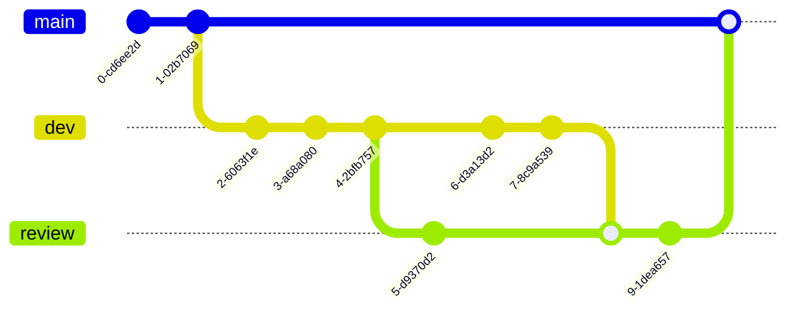

Por eso, usualmente haces una rama adicional para trabajar, y luego haces merge al main

note: Decir que por esto se intenta mantener limpia

---

#### Crear una rama nueva

![[talleres/Taller Github/attachments/github-merge-09.png|300]]

![[talleres/Taller Github/attachments/github-merge-10.png]]

---

#### Hacer cambios

![[talleres/Taller Github/attachments/github-merge-12.png]]

---

#### Tambien el upstream puede hacer cambios

![[talleres/Taller Github/attachments/github-merge-13.png]]

note: Haz cambios en FizzFuzz y bubble. Y poner el texto de la investigación

---

¿Cómo podemos *sincronizar* los cambios?

note: Primero puedes definir la rama principal, todo se sincroniza así

---

### Worflow usando la rama de main


**Upstream** es el repositorio original

note: Tu trabajas en tu fork, y luego haces un pull request para updetear el upstream

---

## Fetch \& Pull

- **Fetch** es la acción de pedir los cambios Github
- **Pull** es la acción de traerse los cambios a tu computadora local


---

## Pull desde upstream

<split left="4" right="2" gap="1">

Para sincronzar tu repositorio local con el repositorio original, le puedes picar a "Update from upstream/main" para que se sincronicé con el dueño del repositorio

![[talleres/Taller Github/attachments/github-merge-14.png|10]]

</split>

---

### Resumen de sincronización

1. Para traerte los cambios del original "Update from upstream"
2. Para traerte cambios de tu repositorio en github (origin) **fetch** y luego **pull**

---

### Tu turno


**Updatea tus main con los cambios mas actuales**

---

### Tu turno


**Haz cambios en otra rama en tu fork y haz un push a Github**

---

<!-- .slide: data-auto-animate -->

### Pull request

Un **pull request** es la manera de solicitar al _dueño del repo_ que haga un _merge_ a nuestros cambios


---

<!-- .slide: data-auto-animate -->

### Pull request

![[talleres/Taller Github/attachments/github-merge-15.png|700]]

Hay ocasiones donde se pueden mezclar sin problema

note: Tienes que pedir un voluntario que quiera hacer un pull request

---

<!-- .slide: data-auto-animate -->

### Pull request

![[talleres/Taller Github/attachments/github-merge-17.png|700]]

Hay veces que se pueden mezclar con problemas

---

### Tu turno


**Hazme un pull request**

note: Esperar a que haya uno

---

Me has solicitado cambios, ahora los tengo que revisar!

---

<!-- .slide: data-auto-animate -->

### Revisando el Pull Request

![[talleres/Taller Github/attachments/github-merge-18.png]]

---

<!-- .slide: data-auto-animate -->

### Revisando el Pull Request

![[talleres/Taller Github/attachments/github-merge-19.png]]

---

<!-- .slide: data-auto-animate -->

### Revisando el Pull Request

![[talleres/Taller Github/attachments/github-merge-20.png|700]]

---

#### Puede haber problemas cuando hago un merge

A esto se le llama **merge conflict**. Solamente tienes que ver el archivo y borrar lo que no quieres.

![[talleres/Taller Github/attachments/github-merge-21.png|600]]

---

<split left="2" right="1" gap="1">

Aqui se puede ver que hay una sección arriba que viene de _rama-jesus_ y la sección de abjo que viene de _main_. El que complete el **pull request** decide con cual cambio quedarse

![[talleres/Taller Github/attachments/github-merge-22.png|500]]

</split>

---

<!-- .slide: data-auto-animate -->

### Revisando el Pull Request

Una vez que aceptes los cambios, puedes hacer **merge**

![[talleres/Taller Github/attachments/github-merge-23.png|700]]

---

<!-- .slide: data-auto-animate -->

### Revisando el Pull Request

![[talleres/Taller Github/attachments/github-merge-24.png|700]]

---

Se aceptaron tus cambios! 🥳

Ahora tenemos que sincronizar el repositorio de todos! Puedes hacer un "Update from upstream/main" para traer los cambios a tu computadora

Después haces un **push** para subirlo en tu repositorio

---

![[talleres/Taller Github/attachments/github-merge-27.png]]

---

Con esto podemos hacer colaboración en **Github**!! 🥳

---

### 🤔Reflexión

¿ Qué ventajas tiene usar **Git** y **Github** para colaborar ?
¿ Que diferencias encuentras de tu propio método de colaborar?

---

Último super poder

---

## ⏳🔙Regresar en el tiempo

Cuando tienes un historial en **Git** puedes **regresar a versiones anteriores** en tu proyecto!

---

### 🤔Recordemos los cambios que hubieron en la entrega

1. Borrar `bubbleSort.py`
2. Hacer el `quicksort.py`
3. El profesor cambió de parecer y ahora quería los 2

---

Borramos `bubblesort`

---


### Implementación de quicksort

```python
def partition(array, low, high):
    pivot = array[high]
    i = low - 1
    for j in range(low, high):
        if array[j] <= pivot:
            i = i + 1
            (array[i], array[j]) = (array[j], array[i])
    (array[i + 1], array[high]) = (array[high], array[i + 1])
    return i + 1

def quickSort(array, low, high):
    if low < high:
        pi = partition(array, low, high)
        quickSort(array, low, pi - 1)
        quickSort(array, pi + 1, high)
```


---

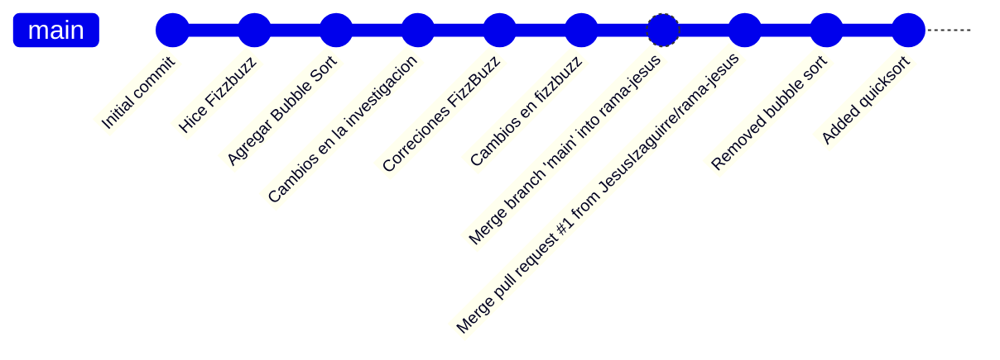

¿Qué hacemos ahora?

---

### ⏳🔙Regresar en el tiempo

Cuando tienes un historial en **Git** puedes **regresar a versiones anteriores** en tu proyecto!

---

### Demostración de como regresar en el tiempo


==Puede que en Github Desktop de Linux no funcione 😢==

note: en linux no se puede con al GUI

Pero enseña como podemos regresar en el tiempo

Haz un setup de la pantalla de manera dual 

---

### Tu turno


**Regresa en el tiempo!**

---

Para regresar a la versión más actual, puedes cambiar de rama

---

#### Identificamos el commit antes de borrar el bubble sort

![[talleres/Taller Github/attachments/github-merge-31.png]]

---

#### Creamos una rama a partir de ese commit

![[talleres/Taller Github/attachments/github-merge-32.png]]

---

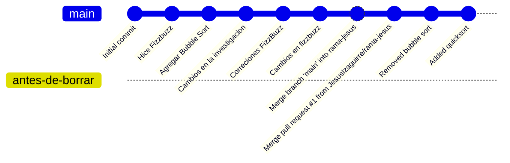

---

#### Hacemos una copia de lo que necesitamos

![[talleres/Taller Github/attachments/github-merge-34.png]]

---

#### Hacemos un merge con el main

![[talleres/Taller Github/attachments/github-merge-36.png|500]]

---

<!-- .slide: data-auto-animate -->

#### Listo recuperamos el archivo !!

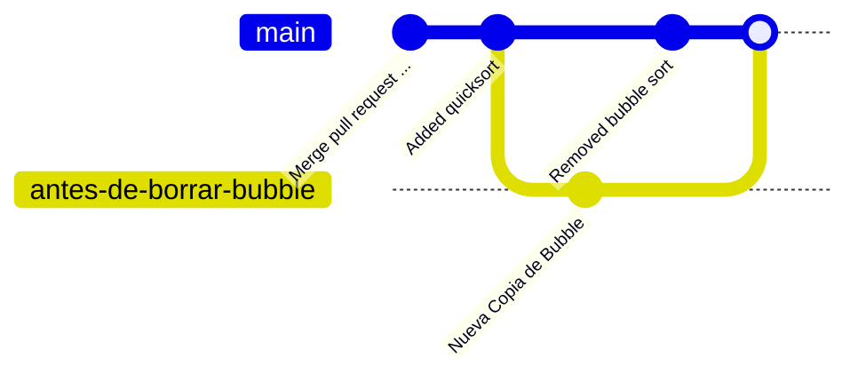

---

<!-- .slide: data-auto-animate -->

#### Listo recuperamos el archivo !!

![[talleres/Taller Github/attachments/github-merge-37.png]]

Ahora lo podemos renombrar a `bubblesort.py`

---

#### Nota sobre regresar en el tiempo

Poder regresar tiempo es muy útil y te puede servir para los siguiente:

- Revisar cambios pasados (para debugging o recordar cambios)
- Recuperar cambios pasados
- Abrir una rama nueva a partir de un commit anterior (para trabajar en versiones alternas)

---

#### Caso especial si quieres "deshacer" un commit

Si quieres "deshacer" un comit. Hay una opción que se llama _revert_ que hace un commit que deshace los cambios!

![[talleres/Taller Github/attachments/github-merge-39.png]]

Esto se tiene que hacer si quieres compartir el movimiento en **Github**

---

#### No te olvides de sincronizar los cambios

![[talleres/Taller Github/attachments/github-merge-40.png]]

![[talleres/Taller Github/attachments/github-merge-41.png]]

---


### 🤔Reflexión

¿ Qué ventajas tiene poder **regresar en el tiempo** en tu trabajo ?

---

# Fin de la entrega

![[talleres/Taller Github/attachments/fin-entrega-archivos.png]]

---

🎉🎉🎉

# Felicidades!! Ahora sabes los básicos de **Git** y **Github**!!

🎉🎉🎉

---

## :pencil:Tips and tricks

- Usar la _terminal_ con _git_ es mucho más rápido, flexible y convencional. Además de que se pueden automatizar proceso
- Muchos softwares tienen integración con git (E.g. Vscode y Matlab)
- Hay muchísimos más comandos y funciones de **git**! Esto solamente fue un overview de los básicos, pero esto no acaba aquí!

---

Gracias por su atención :smiley:
