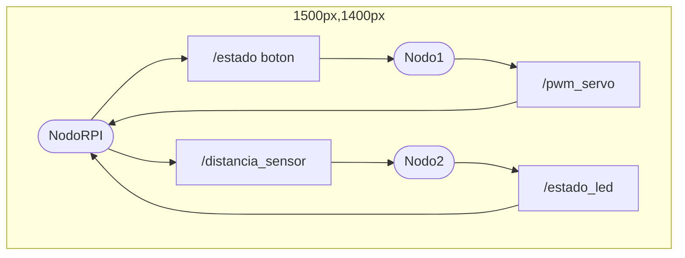

# Bienvenidxs a Introducción ROS2

---

## ¿Qué Es ROS?

**Robotic Operating System (ROS)** es un set the software y herramientas para escribir **aplicaciones** para robots

[Video de introducción de ROS](https://vimeo.com/639236696)

---
### ¿Porqué Es ROS?

Permite la integración entre múltiples sensores, algoritmos y comandos de una manera más amigable


Puedes levantar varios nodos que corrar de menera simultanea, sin necesdidad de configurar **multitrehading** o la comunicación

---

# ROS O ROS2?

🤔

note: 

Decir que ROS es el predecesor

---

## Diferencia Entre ROS Y ROS2

**ROS2** es el sucessor de **ROS**. Tiene más features como:

- Usa python3.7 y C++11
- Puedes grabar archivos "bag" para guardar datos del proecso
- Tiene serguirdad integrada
- Aplicable para aplicaciones de tiempo real
- Maneja aplicaciones a grande escala, industriales y comerciales

---

### 💀ROS va a ser descontinuado

---

### 🦸ROS2 sigue en constante desarrollo

note: 

Decir que a partir de ahora, siempre que digamos "ros" nos referimos a **ros2**

---

<!-- .slide: data-auto-animate -->

### ¿Dónde se usa ROS?

- Autonomous Vehicles
- Industrial Automation
- Internet of Things (IoT)
- Healthcare Robotics
- Aerospace
- Collaborative Robots (Cobots)
- Research and Education

note: 

1. **Autonomous Vehicles:**  ROS2's real-time capabilities and improved security are critical for the development and operation of self-driving cars, drones, and underwater vehicles.
1. **Industrial Automation:**  Robotics arms, automated guided vehicles (AGVs), and other robotic systems in manufacturing and logistics can benefit from ROS2's improved communication and control features.
1. **Internet of Things (IoT):**  ROS2 can facilitate the integration of robots with sensors and other IoT devices in smart homes, smart cities, and smart factories due to its support for diverse communication protocols.
1. **Healthcare Robotics:**  In surgical robots, rehabilitation devices, and hospital logistics robots, ROS2's real-time processing and enhanced security ensure safe and reliable operations.
1. **Aerospace:**  For drones and rovers used in exploration, mapping, and surveillance, ROS2 offers robustness and the ability to handle complex communication systems.
1. **Collaborative Robots (Cobots):**  ROS2's features support better human-robot interaction, necessary for cobots working alongside humans in shared workspaces.
1. **Research and Education:**  Academic institutions can use ROS2 for cutting-edge research in robotics, ensuring that students and researchers are working with industry-standard tools.

---

<!-- .slide: data-auto-animate -->

### ¿Dónde se usa ROS?

- Entertainment
- Agriculture
- Search and Rescue Missions
- Marine Robotics
- Service Robots
- Military and Defense
- Space Exploration

note: 

[Ejemplos de ros](https://design.ros2.org/articles/why_ros2.html)

Ejemplos de aplicaciones: 

1. **Entertainment:**  Theme parks and entertainment industries can employ ROS2 to control animatronics and interactive robots for enhanced audience experiences.
1. **Agriculture:**  For precision agriculture, ROS2 can help manage fleets of agricultural robots used for planting, monitoring crops, and harvesting.
1. **Search and Rescue Missions:**  ROS2's reliable communication system is ideal for coordinating multiple robots in challenging environments during search and rescue operations.
1. **Marine Robotics:**  In underwater exploration and monitoring, ROS2's support for robust, distributed systems is invaluable for managing complex tasks and data collection.
1. **Service Robots:**  For robots that operate in service industries, like those in hospitality or retail, ROS2's enhanced interaction capabilities and security features are crucial.
1. **Military and Defense:**  ROS2 can be used to develop and deploy robots for surveillance, bomb disposal, and logistics support in defense applications.
1. **Space Exploration:**  Space rovers and robotic assistants for astronauts can be developed using ROS2, taking advantage of its robustness and advanced communication capabilities.

---


<grid drag="100 50" drop="bottom">
![[carrito-robotico2.jpeg|485]]
%% Carro horizontal %%
</grid>

<grid drag="70 50" drop="topleft">
![[carrito-robotico1.jpeg|200]]
%% Carro vertical %%
</grid>

<grid drag="70 50" drop="topright">
![[carrito-robotico-3.jpeg|200]]
%% Carro vertical 2 %%
</grid>

<grid drag="35 100" drop="left" rotate="270">
**Ejemplo: Control del carrito**
%% Carro vertical 2 %%
</grid>

note:

Aqui es la demostración del carrito

---

![[P2 Reference Coordinates.png]]

note: 

Mostrar como funciona

---

### 🤖¿Listos para aprender?


---

## ⚡Super Fast Linux Terminal Review⚡

---

### ¿Por Qué Necesitamos la Terminal?

La terminal es la manera de poder hablar con `ros2`:

```sh
$ ros2 run rasp_pkg raspberry_node.py
```

```sh
$ ros2 topic echo /speed_rpm
```

```sh
$ colcon build --symlink-install --packages-select rasp_pkg
```

Estos son algunos de ejemplos de commandos en `ros2`

---

<!-- .slide: data-auto-animate -->
### ⚡🚢Navegación En File System

---

<!-- .slide: data-auto-animate -->
### ⚡🚢Navegación En File System

- `pwd`: *Print working directory* Te dice en que ubicación estás
- `ls`: *list* Te puestra los archivos y los directorios
- `cd <directory>`: *Change directory* te mueve al directorio que le pongas
- `mkdir <directory>`: Crea un directorio en el `pwd`
- `rmdir <directory>`: Elimina un directorio vacío
- `touch <filename>`: Crea un archivo en el `pwd`
- `rm <filename>`: Elimina un archivo

note:

Mostrar los comandos de linux

Puedes hacer el siguiente ejemplo:

1. Abres la terminal en el `~`
2. Listeas el contenido
3. Te metes a `Documents`
4. Crear una carpeta `documentos_personales`
4. Crear una carpeta `codigo_taller`
5. Hacer un archivo `main.py`
5. Hacer un archivo `test.py`
6. Borrar archivo `test.py`
7. Editarlo `main.py` con `code`
8. Salirte de la carpeta `codigo_taller`
9. Borrar `documentos_personales`
10. Borrar `codigo_taller`

```sh
# Init terminal
$ pwd
/home/edy
$ ls
Desktop  Documents  Downloads  snap
$ cd Documents/
$ ls
$ mkdir documentos_personales
$ mkdir codigo_taller
$ cd codigo_taller/
$ pwd
/edy/Documents/codigo_taller
$ ls
$ touch main.py
$ touch test.py
$ ls
main.py  test.py
$ code main.py
$ rm test.py
$ cd ..
$ rmdir documentos_personales/
$ rmdir codigo_taller/
rmdir: failed to remove 'codigo_taller/': Directory not empty
$ rm -rf codigo_taller/
$ ls
```

Estas son las notas de la investigación

![[Introduccion a Linux#Navegación Por El FileSystem]]

---

<!-- .slide: data-auto-animate -->
### ⚡⚙Agregar Configuraciones

---

<!-- .slide: data-auto-animate -->
### ⚡⚙Agregar Configuraciones

Cuando se abre la terminal, se leen las configuraciones en el `.bashrc` y luego empieza *la session*

![[Introduccion a Linux#^98a36b]]

Para leer las configuraciones se usa el comando `source`

note:

Si los usuarios no están usando bash, comentar que puede ser `.zhrc` o algo parecido

---

<!-- .slide: data-auto-animate -->
### ⚡⚙Agregar Configuraciones

Puedes agregar más configuraciones en *la sessión* usando el comando de `source`

```sh
# Init terminal
$ source ~/.bashrc
$ source ~/.config.sh
$ source ~/.install.sh

```

---

<!-- .slide: data-auto-animate -->
### ⚡⚙Agregar Configuraciones

![[Introduccion a Linux#^2d5420]] <!-- element style="width:130%; height:auto;" -->

Esto nos servirá para configurar `ros` cuando estemos usando la terminal

---

<!-- .slide: data-auto-animate -->
### ⚡🐍Python

---

<!-- .slide: data-auto-animate -->
### ⚡🐍Python

Puedes usar **Python** desde la terminal:

![[Introduccion a Linux#^a117d1]]

![[Introduccion a Linux#^dd2dba]]

note:

Hacer un ejemplo de un `hello world`

**main.py**

```python
def main():
  print("hello world!!")

if __name__ == "__main__":
  main()
```

---

<!-- .slide: data-auto-animate -->
### ⚡🐍Python

Ocasionalmente, puedes necesitar que el archivo de *python* sea un *ejecutable*. Para esto se necesitan 2 condiciones:

1. Cambiar el modo del archivo a ejecutable
2. Agregar `#!/usr/bin/env python3` al principio del archivo

---

Ejemplo con archivo `hello-world.py`

```python
print("hello world")
```

```bash
$ python3 hello-world.py # outputs "hello world"
```

note: 

Mencionar que así se corren los archivos normalmente

---

Agregas la linea para que la terminal pueda saber como correr el archivo de python

```python
#!/usr/bin/env python3

print("hello world")
```

Cambias el modo con el comando `chmod`

```bash
$ chmod +x hello-world.py
```

Ahora se puede llamar así

```bash
$ ./hello-world.py # outputs "hello world"
```

note: 

Mencionar que esto sirve para que otros programas puedan usar el archivo de python

---

### Instalar paquetes

En Python puedes usar paquetes y librerías **externas**. Para instalarlo, puedes usar `pip` (pip3)

```bash
$ sudo apt install python3-pip # instalar pip
```

```bash
$ pip install <package_name> # instalar paquetes
```

---

### Paquete necesario para Raspberry Pi

El paquete `RPi.GPIO` es un paquete que se usa para poder controlar la `raspberry pi`: 

```bash
pip install RPi.GPIO
```

---

<!-- .slide: data-auto-animate -->
### ⚡🐍Python

También puedes crear **ambientes virtuales** en python:

![[Python#^0152ce]]

Se crea una carpeta `.venv` con las dependencias de python

%% No se si se tiene que mostrar esto! %%

note:

Hacer los comandos que vienen en la presentacion

---

<!-- .slide: data-auto-animate -->
### ⚡🐍Python

Para *activar* el ambiente virtual, usamos el comando: 

![[Python#^87b519]]

Con esto, nuestro `python` cambia a usar el de la carpeta `.venv`

%% No se si se tiene que mostrar esto! %%

note:

1. Activa el ambiente virtual
2. Decir que ahora puedes usar `python normal`

---
### Estructura general de ROS2

![[Estructura_general_ROS.excalidraw.png|500]]

---
<!-- .slide: data-auto-animate -->
### Workspaces
El workspace es donde se va a hacer todo el código de la aplicación de ROS2

Para crear un workspace se hace lo siguiente
```bash
cd
mkdir ros2_ws
cd ros2_ws
mkdir src
colcon build
```
Ahora el ros2_ws debe contener 4 folders:

-build -install -log -src

---
Ahora se requiere hacer source del **~/ros2_ws/install/setup.bash** para que cada vez que se abra la terminal se detecte este workspace

Para hacer source y agregarlo al bashrc se puede correr el siguiente comando:

```bash
cd
source ~/ros2_ws/install/setup.bash && echo "source ~/ros2_ws/install/setup.bash" >> .bashrc
```
---
Para confirmar que todo el environment de ROS2 esté configurado correctamente, corre el siguiente comando:
```bash
cd
gedit ~/.bashrc
```

Ve hasta abajo del documento y se deben ver las siguientes 3 líneas:
``` gedit
source /opt/ros/humble/setup.bash
source ~/ros2_ws/install/setup.bash
source /usr/share/colcon_argcomplete/hook/colcon-argcomplete.bash
```

---
### Turtlesim 🐢

Turtlesim es un paquete ya incluido de ROS2 que tiene una versión simplificada de una simulación de un robot

Para instalar turtlesim corre el siguiente comando:

```bash
sudo apt install ros-humble-turtlesim
```

Ahora, asegúrate de tener todas las terminales sourceadas con

``` bash
source ~/.bashrc
```

---
Para correr la interfaz de turtlesim corre lo siguiente en una terminal:

```bash
ros2 run turtlesim turtlesim_node
```

Ahora en una terminal diferente:

``` bash
ros2 run turtlesim turtle_teleop_key
```

---
Mientras estas en la terminal de teleopkey, puedes controlar la tortuga de la interfaz
![[Correr Turtlesim.png]]
---
Ahora para ver un ejemplo de lo que se puede llegar a hacer con esta simple aplicación, corre el siguiente comando

``` bash
cd
cd ~/ros2_ws/src/
git clone https://github.com/davidogarzas/taller_ros.git
cd ..
colcon build
source ~/ros2_ws/install/setup.bash
```

---
Ahora se requeriran 4 terminales. Para cada terminal, corre los siguientes comandos:

``` bash
ros2 run turtlesim turtlesim_node
```

``` bash
ros2 run turtle3 manager
```

``` bash
ros2 run turtle3 movement
```

``` bash
ros2 run turtle3 spawner
```

Ahora deberás ver un programa en el que automáticamente aparecen tortugas en la interfaz y la tortuga principal persigue y atrapa a las tortugas que aparecen

---

![[turtle_chaser.png]]

---
### Funcionamiento general

Esquemática general ejemplo del funcionamiento de ROS2

![[diagrama_ejemplo_ros2.png|500]]
---
Funcionamiento:
1. Se crea un *Nodo* con un *Publisher*
2. Se crea un *Nodo* con un *Subscriber*
3. *Publisher* manda *mensajes* a un *topic*
4. *Subscriber* recibe los *mensajes* del mismo *topic*
Un mismo nodo puede tener tantos publishers y subscribers como se desee
---
### Paquetes
Conjunto de nodos que forman una red en ROS2
```bash
cd ~/ros2_ws/src

# Creación del paquete llamado ros2_pkg de tipo python
ros2 pkg create ros2_pkg --build-type ament_python --dependencies rclpy
cd ..
colcon build --packages-select ros2_pkg

# Configuración para que ROS2 detecte el paquete
source ~/.bashrc
```
---
### Topics y Messages 

![[topics.png|900]]
Los *Topics* son los canales por los que los nodos se comunican.
Toda la información que fluye por el *topic* debe estar en formato de un *message*.

---
### Topics y Messages
![[ejemplo_mensaje.png|400]]
Los *mensajes* son el tipo de **toda la información** que fluye en el *topic*. 

Se declaran en un *package* separado y se importan. 

---
## ¿Cómo crear un nodo?

Ir al source del workspace
```bash
# Ir al src del ws
cd ~/ros2_ws/ros2_pkg/src/ros2_pkg/ros2_pkg

```
Crear el archivo .py y configurarlo como ejecutable
```bash
touch node_name.py
cd ..
```
---
3. Añadir el ejecutable a ROS2 en *setup.py*
``` python
entry_points = {
	'console_scripts': [
			"node_name = ros2_pkg.node_name:main"
		],
}
```

4. Editar el nodo: Tomar como base la template
5. Regresar al directorio del workspace y hacer *colcon build*
```bash
cd ~/ros2_ws
colcon build --packages-select ros2_pkg --symlink-install
```
%% Mencionar qué es packages-select y symlink-install Mostrar el código de ejemplo y de añadir el ejecutable desde la VM. El ejemplo de código lo va a mostrar garza%%

---
## Template Nodo
Un nodo se divide en dos partes principales

Esta es la sección que se edita para hacer el funcionamiento deseado
```python
import rclpy
from rclpy.node import Node

class NodeName(Node):
    def __init__(self) -> None:
        super().__init__('node_name')
        # Create Publishers
        # Create Subscribers
        # Initialize attributes
        # Create timers
    # Create callback methods (subscribers and timers)
```
---
Esta sección siempre es la misma para todos los nodos, lo único que hay que cambiar son:
- node_name
- NodeName()

```python
def main(args=None) -> None:
    rclpy.init(args=args)
    node_name= NodeName()
    rclpy.spin(node_name)
    node_name.destroy_node()
    rclpy.shutdown()
if __name__=='__main__':
    try:
        main()
    except Exception as e:
        print(e)
```
---
## Crear ejemplo de Nodo Publisher
Primero se crea un nuevo nodo llamado my_first_publisher.py
```bash
cd ~/ros2_ws/ros2_pkg/src/ros2_pkg/ros2_pkg
touch my_first_publisher.py
```
---
### Copiar código de template al nuevo nodo y editar NodeName y node_name
``` python
import rclpy
from rclpy.node import Node

class MyFirstPublisher(Node):
    def __init__(self) -> None:
        super().__init__('my_first_publisher')
        # Create Publishers
        # Create Subscribers
        # Initialize attributes
        # Create timers
    # Create callback methods (subscribers and timers)
```
---
```python
def main(args=None) -> None:
    rclpy.init(args=args)
    my_first_publisher= MyFirstPublisher()
    rclpy.spin(my_first_publisher)
    my_first_publisher.destroy_node()
    rclpy.shutdown()
if __name__=='__main__':
    try:
        main()
    except Exception as e:
        print(e)
```
---
## Agregar ejecutable al setup.py
``` python
entry_points = {
	'console_scripts': [
			"MyFirstPublisher = ros2_pkg.my_first_publisher:main"
		],
}
```
---
## Agregar atributos 
``` python
import rclpy
from rclpy.node import Node

class MyFirstPublisher(Node):
    def __init__(self) -> None:
        super().__init__('my_first_publisher')
        # Create Publishers
        # Create Subscribers
        # Initialize attributes
        self.counter = 0
        # Create timers
    # Create callback methods (subscribers and timers)
```
---
## Agregar Timers
- Definir el periodo del Tic-Tac
- La función *callback* que ejecuta en cada periodo
---

```python
import rclpy
from rclpy.node import Node

class MyFirstPublisher(Node):
    def __init__(self) -> None:
        super().__init__('my_first_publisher')
        # Create Publishers
        # Create Subscribers
        # Initialize attributes
        self.counter = 0
        # Create timers
        self.timer = self.create_timer(
	        1.0,self.timer_callback)
    # Create callback methods (subscribers and timers)
    def timer_callback(self):
	    self.counter = self.counter + 1
```
---

## Agregar Publishers
- Definir la clase del message: tipo de message
	- Importar la interfaz: String de std_msgs.msg
- El *topic* al cual se publica.
	
---

```python
import rclpy
from rclpy.node import Node
from std_msgs.msg import String

class MyFirstPublisher(Node):
    def __init__(self) -> None:
        super().__init__('my_first_publisher')
        # Create Publishers
        self.example_publisher = self.create_publisher(
	        String,"example_topic",10)
        # Create Subscribers
        # Initialize attributes
        self.counter = 0
        # Create timers
        self.timer = self.create_timer(
	        1.0,self.timer_callback)
    # Create callback methods (subscribers and timers)
    def timer_callback(self):
	    msg = String()
	    msg.data = "Hello World" + str(self.counter)
	    self.example_publisher.publish(msg)
	    self.counter = self.counter + 1
```
---
## Hacer el build del nodo
``` bash
cd ros2_ws
colcon build --packages-select ros2_pkg --symlink-install
source ~/.bashrc
```
---
## Correr el nodo
``` bash
ros2 run ros2_pkg MyFirstPublisher
```
Para confirmar que se haya creado el topic se puede hacer
``` bash
ros2 topic list
```
Para ver qué está publicando se puede hacer echo
``` bash
ros2 topic echo /example_topic
```
---
![[topic list y topic echo.png]]

---

### 😵Mucha terminal


A veces muchos nodos están interactuando, y se vuelve complicado ver como se relacionan

note: 

Mencionar que puede que tengas muchos topics y quieres verlos de manera gráfica

---

## RQT Graph

`rqt_graph` es un comando que despliega la gráfica de los nodos corriendo. 

```sh
rqt_graph
```

![[rqt_graph-gui.png|600]]

note: 

Mostrar el ejemplo practico en clase antes de mostrarlo, y luego muestras el `rqt_graph`

---

``` bash
rqt_graph
```

![[my_first_publisher-example_topic.png]]

---
## Crear ejemplo de Nodo Subscriber
Ahora se seguirá el mismo procedimiento para crear un nodo subscriber
```bash
cd ~/ros2_ws/ros2_pkg/src/ros2_pkg/ros2_pkg
touch my_first_subscriber.py
```
---
### Copiar código de template al nuevo nodo y editar NodeName y node_name
``` python
import rclpy
from rclpy.node import Node

class MyFirstSubscriber(Node):
    def __init__(self) -> None:
        super().__init__('my_first_subscriber')
        # Create Publishers
        # Create Subscribers
        # Initialize attributes
        # Create timers
    # Create callback methods (subscribers and timers)
```
---
```python
def main(args=None) -> None:
    rclpy.init(args=args)
    my_first_subscriber = MyFirstSubscriber()
    rclpy.spin(my_first_subscriber)
    my_first_subscriber.destroy_node()
    rclpy.shutdown()
if __name__=='__main__':
    try:
        main()
    except Exception as e:
        print(e)
```
---
## Agregar ejecutable al setup.py
``` python
entry_points = {
	'console_scripts': [
			"MyFirstPublisher = ros2_pkg.my_first_publisher:main",
			"MyFirstSubscriber = ros2_pkg.my_first_subscriber:main"
		],
}
```
---
## Agregar Subscriber
Para crear un subscriber se requiere de dos partes:
- La variable que está escuchando al topic
- El callback que se ejecuta cada vez que se recibe un mensaje
---
Asegurarse que el tipo de msg y el topic sean los mismos que los del publisher!!
``` python
import rclpy
from rclpy.node import Node
from std_msgs.msg import String

class MyFirstSubscriber(Node):
    def __init__(self) -> None:
        super().__init__('my_first_subscriber')
        # Create Publishers
        # Create Subscribers
        self.example_subscriber = self.create_subscription(
	        String,"example_topic",self.subscriber_callback,10)
        # Initialize attributes
        # Create timers
    # Create callback methods (subscribers and timers)
    def self.subscriber_callback(self,msg):
	    msg_received = msg.data
	    self.get_logger().info("Message received: " + msg_received)
```  
---
## Hacer el build del nodo
``` bash
cd ros2_ws
colcon build --packages-select ros2_pkg --symlink-install
source ~/.bashrc
```
---
## Correr publisher y subscriber
Correr el publisher
``` bash
ros2 run ros2_pkg MyFirstPublisher
```
Correr el subscriber
``` bash
ros2 run ros2_pkg MyFirstSubscriber
```
---
Para ver la interaccion entre ambos se puede ver rqt_graph
``` bash
rqt_graph
```
![[rqt_graph publisher y subscriber.png|500]]

---
## Crear publishers y subscribers en un mismo nodo
Objetivo: Lograr que el subscriber publique el resultado de 2\*n de cada mensaje que reciba en otro topic.

Agregamos: 
- Int64 de std_msgs
- Creamos un counter 
- Creamos un publisher
---
``` python
import rclpy
from rclpy.node import Node
from std_msgs.msg import String, Int64

class MyFirstSubscriber(Node):
    def __init__(self) -> None:
        super().__init__('my_first_subscriber')
        # Create Publishers
        self.publisher_2n = self.create_publisher(
	        Int64,"multiplier_topic",10)
        # Create Subscribers
        self.example_subscriber = self.create_subscription(
	        String,"example_topic",self.subscriber_callback,10)
        # Initialize attributes
        self.counter = 0
        # Create timers
    # Create callback methods (subscribers and timers)
    def self.subscriber_callback(self,msg):
	    msg_received = msg.data
	    self.get_logger().info("Message received: " + msg_received)
	    new_msg = Int64()
	    new_msg.data = 2*self.counter
	    self.publisher_2n.publish(new_msg)
	    self.counter = self.counter + 1
```  
---
No es necesario hacer *colcon build*, se modificó el nodo.
De nuevo corremos ambos nodos

Correr el publisher
``` bash
ros2 run ros2_pkg MyFirstPublisher
```
Correr el subscriber
``` bash
ros2 run ros2_pkg MyFirstSubscriber
```
---
Podemos hacer topic list y deben aparecer los 2 topics
``` bash
ros2 run topic list
```
Tambien podemos hacer echo al nuevo topic
``` bash
ros2 run topic echo /multiplier_topic
```
Finalmente podemos revisar rqt_graph
Correr el publisher
``` bash
rqt_graph
```
---
![[rqt_graph modified subscriber.png]]

---
### Interfaces
Hasta ahora hemos visto algunos tipos de mensajes ya incluidos por ROS de std_msgs.

Podemos ver todos los mensajes que existe:
``` bash
ros2 interface list
```

---

Para ver qué contiene un tipo de mensaje se usa el siguiente comando:
``` bash
ros2 interface show <interfaz>
```

---
Por ejemplo, para ver la interfaz de example_interfaces/msg/String:
``` bash
ros2 interface show example_interfaces/msg/String
```
![[ros2 interface show example_interfaces_msg_string.png]]
Aqui se puede observar que tiene solo un field llamado "data" de tipo String en el mensaje String.

---
## Crear interfaces
Algo muy recomendado es crear tus propios mensajes
Para esto se sigue la siguiente metodología

Crear un nuevo package:
``` bash
cd ros2_ws/src
ros2 pkg create my_custom_interfaces
```

Ahora vamos a configurar el package:
```
cd my_custom_interfaces
rm -rf include/
rm -rf src/
mkdir msg
```

---
Dentro de este nuevo package, entra al archivo *package.xml* y vamos a editarlo

Debajo de:
```
<buildtool_depend>ament_cmake</buildtool_depend>
```
Agrega las siguientes 3 líneas:
``` xml
<build_depend>rosidl_default_generators</build_depend>
<exec_depend>rosidl_default_runtime</exec_depend>
<member_of_group>rosidl_interface_packages</member_of_group>
```
---
Ahora entra al archivo CMakeLists.txt

Borra la sección de *if(BUILD_TESTING)*

Ahora en la sección de *find_dependencies* agrega las siguientes líneas:
```
find_package(rosidl_default_generators REQUIRED)
rosidl_generate_interfaces(${PROJECT_NAME})
ament_export_dependencies(rosidl_default_runtime)
```
Con esto el paquete ya está configurado y puedes empezar a hacer tus propios mensajes

---

En la terminal vamos a crear un nuevo archivo tipo *.msg* llamado *MyCustomMsg*
``` bash
cd ros2_ws/src/my_custom_interfaces/msg
touch MyCustomMsg.msg
```
IMPORTANTE: Los nombres de los mensajes deben empezar con Mayúscula, y todas las palabras nuevas llevan mayúscula también

---
Abrimos el archivo y vamos a agregar las siguientes líneas:
```
string data1
bool data2
int64[3] data3
```
Ahora en el archivo de CMakeLists, edita la línea de rosidl_generate_interfaces(${PROJECT_NAME}) para que te quede así:
```
rosidl_generate_interfaces({PROJECT_NAME}
	"msg/MyCustomMsg.msg"
)
```
---
Ahora hacemos el build del package
```
cd ros2_ws
colcon build --packages-select my_custom_interfaces
```
En una terminal nueva, podemos revisar que ahora nos aparezca nuestro nuevo mensaje
``` bash
ros2 interface list
```

---
También podemos revisar qué información contiene el mensaje
``` bash
ros2 interface show my_custom_interface/msg/MyCustomMsg
```

![[MyCustomMsg.png]]
---
Finalmente vamos a agregar la dependencia al paquete de 
*ros2_pkg*

Abre el *package.xml* de *ros2_pkg* y agrega la siguiente línea:
``` xml
<depend>my_custom_interfaces</depend>
```
---

Ahora cuando quieras usar este mensaje, lo único que hay que hacer es importarlo al código como
``` python
from my_custom_interfaces.msg import MyCustomMsg
```

note: Si VScode  marca error, tenemos que agregarle un path para que pueda encontrar el archivo.
Ve a Preferences->Settings->Python Auto Complete: Extra Paths->Edit in settings.json

---
## Recap🔙
Pasos para crear un nodo:
1. Crear un archivo .py y agregar lo necesario
	1. Publishers
	2. Subscibers
	3. Timers
	4. Callbacks
	5. Atributos
2. Agregarlo a setup.py
3. Hacer el build en el *directorio del workspace*
4. Hacer el source del proyecto 
```sh 
source ~/.bashrc 
```
5. Correr el nodo
```sh
ros2 run <package> <nodo>
```
---
<!-- .slide: data-auto-animate -->
## ¿Dudas?🤔
---
<!-- .slide: data-auto-animate -->
## Ahora siguen ustedes!😎
---
<!-- .slide: data-auto-animate -->
## Ahora siguen ustedes!😎
### Problema a resolver
Se tiene un *Nodo* corriendo en una Raspberri Pi que está leyendo constantemente el valor de un sensor ultrasónico y el estado de un pulsador. Esta información la publica en topics diferentes.
A su vez, recibe información de otros dos topics para encender un LED y abrir/cerrar una puerta. 
El objetivo del proyecto es lograr:
1. Cuando se pulse el botón la puerta se abra y se cierra automáticamente
2. Cuando haya algún objeto a menos de 10 cm del sensor, el LED se encienda
---
### Diagrama de nodos esperado 


---

![[ejemplo_taller.png]]
---
### Nodo RPi
- **/estado_led**: de tipo Bool. Enciende o apaga el LED. 
- **/pwm_servo**: de tipo String:
	- "ABRIR" - Abre la puerta
	- "CERRAR" - Cierra la puerta
	- "ABRIR MUCHO" - Abre completamente la puerta
- **/distancia_sensor**: de tipo Float32, manda constantemente el valor *leído del sensor* en cm.
- **/estado_boton**: de tipo Bool, manda un True cuando el botón pasa de *no-presionado a presionado.*

Los mensajes se obtuvieron de [std_msgs](https://docs.ros2.org/foxy/api/std_msgs/index-msg.html)

---
<div style="display: flex; flex-direction: row;">
<div style="flex: 1; font-size: 30x;">
Nodo 1

Objetivo: Abrir y cerrar la puerta cada vez que se presione el boton
1. Crear subscriber a /estado_boton 
2. Crear publisher a /pwm_servo 
3. Procesar la información
4. Publicar en /pwm_servo
</div> 
<div style="flex: 1; font-size: 30x;">
Nodo 2

Objetivo: Encender el LED si hay algo cerca del sensor
1. Crear subscriber a /distancia_sensor
2. Crear subscriber a /estado_LED
3. Procesar la información
4. Publicar en /estado_LED

</div> 
</div>

---
<!-- .slide: data-auto-animate -->
### Solución Nodo 1

---
<!-- .slide: data-auto-animate -->
### Solución Nodo 1
```python
# Abre y cierra la puerta cada vez que se oprime el boton
import rclpy
from rclpy.node import Node
from std_msgs.msg import Float32, Bool, String
import time

class Nodo1(Node):
    def __init__(self) -> None:
        super().__init__('Nodo1')

        # Create Publishers
        self.publisher_servo = self.create_publisher(String,"/pwm_servo",10)

        # Create Subscribers
        self.subscriber_boton = self.create_subscription(Bool,"/estado_boton",self.callback_boton,1)

        # Inicializar servo
        inicio = String()
        inicio.data = "CERRAR"
        self.publisher_servo.publish(inicio)

    def callback_boton(self,msg):
        msg_servo = String()
        if (msg.data): # verificar presion de boton
            msg_servo.data = "ABRIR"
            self.publisher_servo.publish(msg_servo)
            time.sleep(2)
            msg_servo.data = "CERRAR"
            self.publisher_servo.publish(msg_servo)
```
%%Mostrar codigo desde la VM %%

---
<!-- .slide: data-auto-animate -->
## Solución Nodo 2
---
<!-- .slide: data-auto-animate --> 
## Solución Nodo 2
```python
# Prende el LED si hay alguien cerca
import rclpy
from rclpy.node import Node
from std_msgs.msg import Bool, Float32
import time

class Nodo2(Node):
    def __init__(self) -> None:
        super().__init__('Nodo2')

        # Create Publishers
        self.publisher_LED = self.create_publisher(Bool,"estado_LED",10)

        # Create Subscribers
        self.subscriber_proximidad = self.create_subscription(Float32,"/distancia_sensor",self.callback_distancia,10)

    # Create callback methods (subscribers and timers)
    def callback_distancia(self,msg):
        distancia = msg.data
        msg_LED = Bool()
        if (distancia < 10.0):
            msg_LED.data = True
        else: msg_LED.data = False
        self.publisher_LED.publish(msg_LED)
```
%%Mostrar codigo desde la VM %%

---
